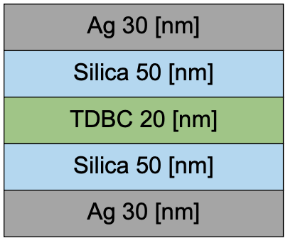

# Multi-Layer Transfer Matrix Method

Computes the transmission, reflection and absorption spectra of a planar microcavities compose of dielectric spacers, 
non-active organic absorbers and metal or dielectric mirrors. Observables are obtained using the transfer matrix (TMM) method.

## Overview 

The transfer matrix method (TMM) for a multi-layer structure is implemented using the field normalization conventions in Chap. 2 of H.A. Macleod's "Thin-Film Optical Filters" (3rd Ed, Taylor & Francis). 

**Input**
Number of layers that compose the microcavity structure, their thickness, and the complex dielectric functions of all materials involved over the wavelengths of interest. 

**Output**
For a given input field incidence angle and field polarization (TM or TE), the code computes the transmission, reflection and absorption spectra over a frequency region of interest. Dispersion curves are obtained by varying the incidence angle. 

## Matlab folder

The folder "matlab" contains example Matlab code (Intensidad.m) for computing the reflectance, transmitance, and absorptance of an L = 180 nm silver metal microcavity with a TDBC absorptive layer and silica spacers, as illustrated below:

## Python folder

The folder "python" contains general code that can be expanded to introduce an arbitrary number of dielectric layers with user-defined dielectric functions.

Two main .py scripts are provided: The file "TMM.py" has the functions needed to compute the observables of a given cavity using the functions defined in the file  "dielectric_functions.py".  

## Jupyter Notebook: TDBC Case Example

The jupyter notebook "intensity.ipynb" in the "python" folder illustrates the use of the python modules, by computing the transmission (T), reflection (R), and absorption spectra (1-R-T) of a silver microcavity with TDBC molecular aggregates, as a function of pump incidence angle (dispersion plots).

## References

This code was developed by Iván Jara (Eng. Phys) as part of the undergraduate thesis ["Simulación computacional de la eficiencia óptica de estructuras OLED"](http://fherreralab.com/assets/resources/thesis-ijara.pdf), Universidad de Santiago de Chile, 2019.